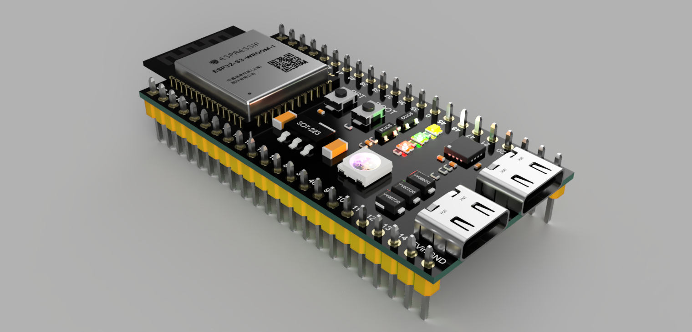

# ESP32-S3 DEVKIT C 16R8 Altium Library

Altium Designer library for ESP32-S3-DEVKIT-C-16R8 module.

## Included

- Schematic Symbol
- PCB Footprint
- 3D STEP Model
- Example Project

## Preview


### PCB


### 3D


## Installation

1. Clone repository

```bash
git clone https://github.com/thanhandev/ESP32-S3-DEVKIT-C-16R8-ALTIUM.git
